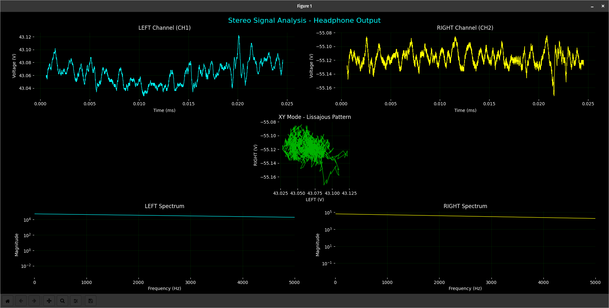
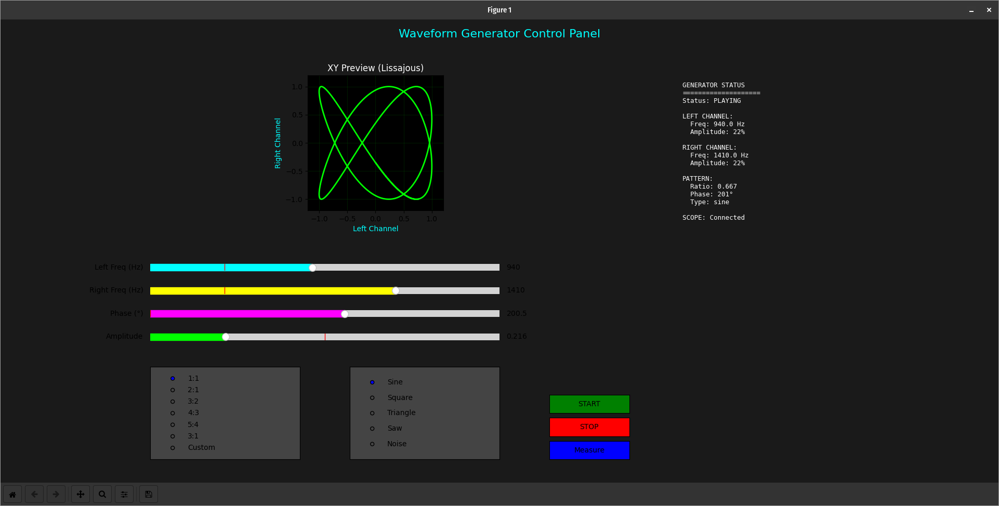
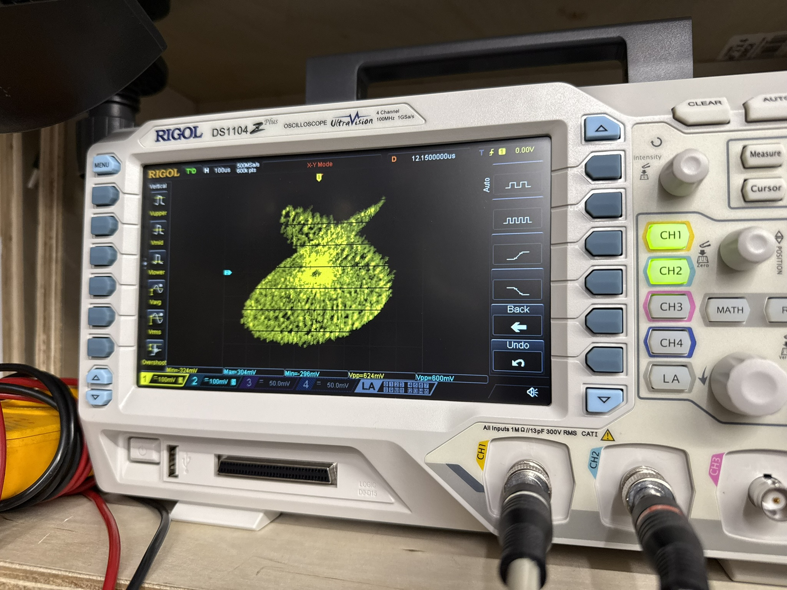
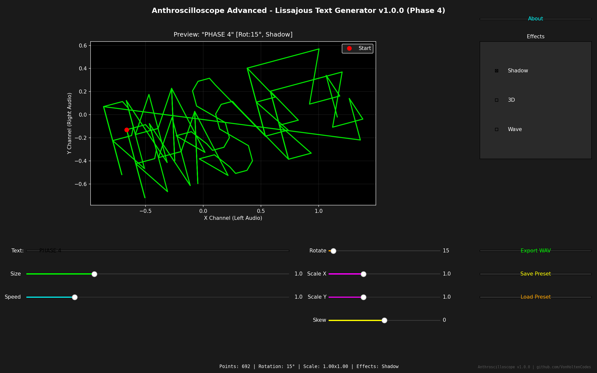
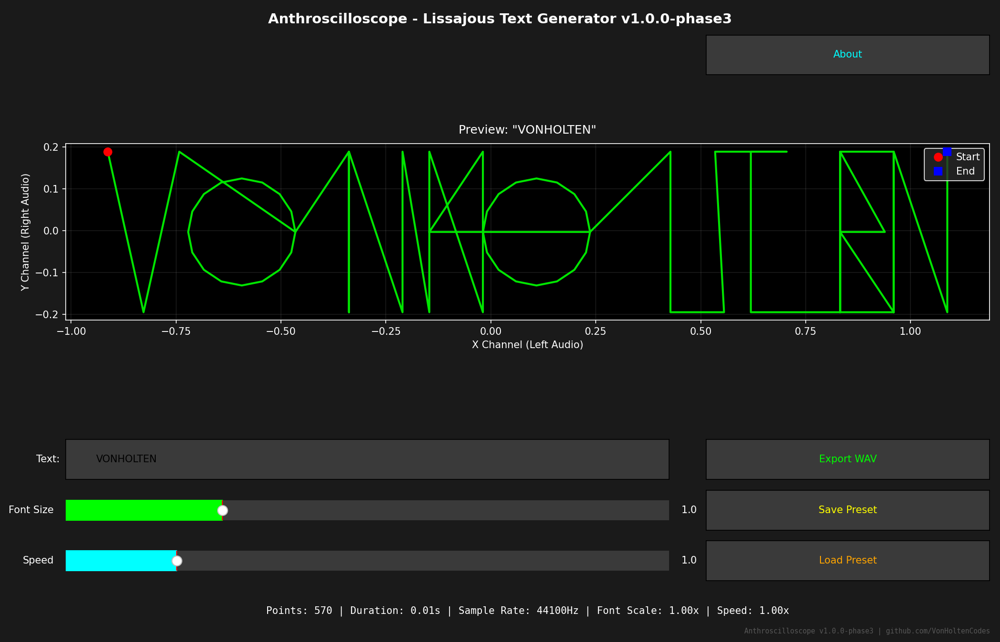

# Anthroscilloscope

```
                 ╔════════════════════════════════════════════════════════════╗
                 ║  ┌────────────────────────────────────────────────────┐    ║
                 ║  │                                                    │    ║
                 ║  │     ╱╲    ╱╲    ╱╲    ╱╲    ╱╲    ╱╲    ╱╲         │    ║
                 ║  │    ╱  ╲  ╱  ╲  ╱  ╲  ╱  ╲  ╱  ╲  ╱  ╲  ╱  ╲        │    ║
                 ║  │   ╱    ╲╱    ╲╱    ╲╱    ╲╱    ╲╱    ╲╱    ╲       │    ║
                 ║  │ ──┼────────────────────────────────────────────┼── │    ║
                 ║  │   │   ANTHROSCILLOSCOPE                        │   │    ║
                 ║  │   │                                            │   │    ║
                 ║  │ ──┼────────────────────────────────────────────┼── │    ║
                 ║  └────────────────────────────────────────────────────┘    ║
                 ║                                                            ║
                 ║  VERTICAL            HORIZONTAL         TRIGGER            ║
                 ║  ┌─────┐ ┌─────┐    ┌─────┐ ┌─────┐    ┌─────┐ ┌─────┐     ║
                 ║  │ ◉   │ │   ◉ │    │  ◉  │ │ ◉   │    │   ◉ │ │  ◉  │     ║
                 ║  └─────┘ └─────┘    └─────┘ └─────┘    └─────┘ └─────┘     ║
                 ║  VOLTS/DIV  POS     TIME/DIV  POS       LEVEL   MODE       ║
                 ║                                                            ║
                 ║  [CH1] [CH2] [MATH] [REF]    [AUTO] [RUN/STOP] [SINGLE]    ║
                 ║   ▀▀▀   ───   ───    ───       ▀▀▀     ───       ───       ║
                 ║                                                            ║
                 ║  ○ CH1  ○ CH2  ○ EXT  ○ LINE         ■ POWER               ║
                 ║  └─BNC─┘└─BNC─┘└─BNC─┘└─BNC─┘         ON/OFF               ║
                 ╚════════════════════════════════════════════════════════════╝
                       ╱│                                          │╲
                      ╱ └──────────────────────────────────────────┘ ╲
                     ╱________________________________________________╲

                     ╔═╗╔╗╔╔╦╗╦ ╦╦═╗╔═╗╔═╗╔═╗╦╦  ╦  ╔═╗╔═╗╔═╗╔═╗╔═╗╔═╗
                     ╠═╣║║║ ║ ╠═╣╠╦╝║ ║╚═╗║  ║║  ║  ║ ║╚═╗║  ║ ║╠═╝║╣ 
                     ╩ ╩╝╚╝ ╩ ╩ ╩╩╚═╚═╝╚═╝╚═╝╩╩═╝╩═╝╚═╝╚═╝╚═╝╚═╝╩  ╚═╝
```

> **Transform your Rigol DS1104Z Plus into a powerful PC-controlled measurement station**

[](https://www.python.org/downloads/)
[](https://pyvisa.readthedocs.io/)
[](https://opensource.org/licenses/MIT)
[](https://github.com/VonHoltenCodes/Anthroscilloscope)

## 📡 What is Anthroscilloscope?

Anthroscilloscope is a comprehensive Python toolkit that brings your Rigol DS1104Z Plus oscilloscope to life on your computer. Whether you're debugging circuits, analyzing signals, creating Lissajous patterns, or automating measurements, this suite provides everything you need for seamless remote control and data acquisition.


*Main control interface with live waveform display and measurement controls*

## 🌐 Web-Based Lissajous Text Generator

**[Try the Live Demo →](https://vonholtencodes.com/lissajous-generator/)**

Convert text to beautiful Lissajous curves for oscilloscope XY mode display! This web-based version of the text rendering engine runs entirely in your browser - no installation required.


**Features:**
- Real-time text-to-Lissajous conversion (A-Z, 0-9)
- Interactive canvas with animation controls
- Export to PNG for images
- Export to WAV for oscilloscope playback (stereo audio)
- Adjustable speed and intensity
- URL sharing with parameters

**How to use with oscilloscope:**
1. Enter your text in the web interface
2. Export as WAV file
3. Connect audio: Left channel → CH1 (X-axis), Right channel → CH2 (Y-axis)
4. Set oscilloscope to XY mode
5. Enjoy vector text on your CRT display!

### ✨ Key Features

- **🎯 Real-Time Waveform Display** - Stream live waveforms directly to your PC with matplotlib visualization
- **📸 Screenshot Capture** - Save high-resolution oscilloscope displays as PNG files
- **📊 Automated Measurements** - Programmatically capture Vpp, Vmax, Vmin, Frequency, Period, and more
- **🔧 No Proprietary Drivers** - Uses pure Python PyVISA backend - no NI-VISA required
- **🖥️ Interactive CLI** - User-friendly menu system for quick measurements
- **🐍 Python API** - Full programmatic control for custom automation scripts
- **🌐 Ethernet/LAN Control** - Fast, reliable connection over your network
- **🎵 Waveform Generator** - Control built-in signal generator (DS1104Z Plus -S models)
- **📈 FFT Spectrum Analysis** - Real-time frequency domain analysis with peak detection
- **💾 Deep Memory Capture** - Acquire up to 12M sample points for detailed analysis
- **🔍 Auto-Discovery** - Automatically find oscilloscopes on your network
- **🌀 NEW: Lissajous XY Mode** - Generate and analyze mathematical art patterns with frequency ratios
- **🎼 Musical Interval Detection** - Identify perfect fifths, thirds, and other harmonic relationships
- **🔊 Audio Signal Generation** - Create test patterns through sound card output
- **✨ Lissajous Text Rendering System** - Complete interactive GUI for rendering text as oscilloscope art via XY mode audio! 🎨
  - **Phase 1**: Core text-to-audio engine with A-Z characters ✅
  - **Phase 2**: Full alphanumeric support (A-Z, 0-9, punctuation) ✅
  - **Phase 3**: Interactive GUI with real-time preview and controls ✅
  - **Phase 4**: Advanced effects (rotation, 3D, shadows, morphing) ✅

## 🚀 Quick Start

### Prerequisites

- Rigol DS1104Z Plus Oscilloscope (or compatible DS1000Z series)
- Python 3.10 or higher
- Ethernet connection between PC and oscilloscope

### Installation

#### Linux/Mac
```bash
# Clone the repository
git clone https://github.com/VonHoltenCodes/Anthroscilloscope.git
cd Anthroscilloscope

# Run the complete setup script
chmod +x anthroscilloscope_setup.sh
./anthroscilloscope_setup.sh

# Or install manually
pip3 install pyvisa pyvisa-py pyusb pyserial matplotlib numpy scipy h5py sounddevice
# Optional: pip3 install pandas zeroconf
```

#### Windows
```batch
REM Clone the repository (or download ZIP from GitHub)
git clone https://github.com/VonHoltenCodes/Anthroscilloscope.git
cd Anthroscilloscope

REM Run the Windows setup script
anthroscilloscope_setup.bat

REM Or install manually
pip install pyvisa pyvisa-py pyusb pyserial matplotlib numpy scipy h5py sounddevice pandas zeroconf
```

> **Note:** Windows batch files are currently under development and untested. Please report any issues.

### First Connection

1. **Configure your oscilloscope for LAN access:**
   ```
   Utility → I/O → LAN Config → DHCP/Static IP
   ```
   Note the IP address displayed

2. **Create configuration file:**
   ```bash
   cp config_template.py config.py
   # Edit config.py with your oscilloscope IP address
   ```

3. **Test the connection:**
   ```bash
   python3 test_rigol_connection.py
   ```

4. **Run the main control interface:**
   
   **Linux/Mac:**
   ```bash
   python3 anthroscilloscope_main.py
   # Or use the launcher:
   ./anthroscilloscope
   ```
   
   **Windows:**
   ```batch
   anthroscilloscope.bat
   ```

## 📖 Usage Examples

### Interactive Menu System

```bash
$ python3 anthroscilloscope_main.py

🎛️ ANTHROSCILLOSCOPE MAIN CONTROL
==================================================

Main Menu:
1. Quick Scope Test (Probe Compensation)
2. Live Waveform Display
3. Single Waveform Capture
4. Save Screenshot
5. Display Measurements
6. Spectrum Analyzer (FFT)
7. Deep Memory Capture
8. Waveform Generator Control
9. Data Export
10. Interactive Lissajous Viewer
11. XY Mode Pattern Analysis
12. Frequency Ratio Calculator
13. Musical Interval Analysis
0. Exit

Select option: 10
[Interactive Lissajous pattern generator launches...]
```

### Python API Usage

```python
from rigol_oscilloscope_control import RigolDS1104Z
import matplotlib.pyplot as plt

# Connect to your oscilloscope
scope = RigolDS1104Z("192.168.1.100")
scope.connect()

# Capture waveform data
time_data, voltage_data = scope.get_waveform_data(channel=1)

# Make measurements
measurements = {
    'Vpp': scope.get_measurement(1, 'VPP'),
    'Frequency': scope.get_measurement(1, 'FREQ'),
    'RMS': scope.get_measurement(1, 'VRMS')
}

print(f"Signal: {measurements['Vpp']:.3f} Vpp @ {measurements['Frequency']:.1f} Hz")

# Save oscilloscope screenshot
scope.save_screenshot("measurement_capture.png")

# Plot the waveform
plt.figure(figsize=(10, 6))
plt.plot(time_data, voltage_data)
plt.xlabel('Time (s)')
plt.ylabel('Voltage (V)')
plt.title('Captured Waveform')
plt.grid(True)
plt.show()

scope.close()
```

### 🌀 NEW: Lissajous Pattern Generation


*Interactive Lissajous pattern generator with real-time control*

```python
from lissajous_xy_mode import LissajousXYAnalyzer, LissajousPattern
from waveform_generator_control import WaveformGeneratorControl

# Create analyzer for oscilloscope XY mode
analyzer = LissajousXYAnalyzer("192.168.1.100")
analyzer.connect()

# Enable XY mode on oscilloscope
analyzer.set_xy_mode(True)

# Generate a 3:2 Lissajous pattern (perfect fifth)
pattern = LissajousPattern(
    freq_x=660.0,  # 3x base frequency
    freq_y=440.0,  # 2x base frequency (A440)
    phase=0.0
)

# Start audio generation through sound card
generator = WaveformGeneratorControl()
generator.freq_left = pattern.freq_x
generator.freq_right = pattern.freq_y
generator.phase = pattern.phase
generator.start_generator()

# Analyze the pattern on oscilloscope
analysis = analyzer.analyze_pattern()
print(f"Detected: {analysis['ratio_simplified']} ratio")
print(f"Musical interval: {analysis['musical_interval']}")
```


*Actual Lissajous pattern displayed on DS1104Z Plus in XY mode*

### 🎨 Text Rendering on Oscilloscope (Phase 4 Complete!)

```bash
# Launch the advanced GUI with effects
python3 text_gui_advanced.py

# Or use the standard GUI
python3 text_gui.py
```

**Phase 4 Advanced Features:**
- **🔄 Rotation** - 0-360° real-time rotation
- **📏 Independent Scaling** - Separate X/Y axis control
- **✨ Skew/Italics** - Shear transformation effect
- **🎭 Shadow Effect** - Drop shadow with offset
- **🌀 3D Perspective** - Pseudo-3D depth and tilt
- **🌊 Wave Distortion** - Sine wave effects
- **🎬 Morphing** - Smooth transitions between text


*Phase 4 Advanced GUI - "PHASE 4" with 15° rotation and shadow effect*

**Phase 3 Core Features:**
- **Real-time Preview** - See your text rendered as Lissajous patterns
- **Font Size Control** - Scale from 0.3x to 3.0x
- **Speed Adjustment** - Control playback speed (0.1x to 5.0x)
- **Export to WAV** - Generate stereo audio files for oscilloscope playback
- **Save/Load Presets** - Store your favorite settings
- **42 Characters** - A-Z, 0-9, punctuation (. , ! ? -)


*Phase 3 Standard GUI with real-time preview and controls*

**How it works:**
1. Enter text in the GUI
2. Adjust rotation, scaling, and effects
3. Watch real-time preview of XY pattern
4. Adjust font size and speed sliders
5. Export to WAV file
6. Play WAV through oscilloscope in XY mode
7. See your text appear on the screen with effects!

### Automated Testing Script

```python
# Quick probe compensation check
from quick_scope_test import quick_probe_test

# Automatically captures and analyzes the probe compensation signal
results = quick_probe_test("192.168.1.100")
print(f"Probe compensation: {results['status']}")
```

## 🛠️ Available Scripts

### Core Scripts
| Script | Description |
|--------|-------------|
| `anthroscilloscope_main.py` | **Main interface with all features** |
| `rigol_oscilloscope_control.py` | Basic control interface |
| `rigol_display_fixed.py` | Optimized live waveform display |
| `test_suite.py` | Comprehensive test suite |

### Feature Modules
| Module | Description |
|--------|-------------|
| `long_memory_capture.py` | Deep memory acquisition (up to 12M points) |
| `spectrum_analyzer.py` | FFT analysis with peak detection |
| `trigger_control.py` | Advanced trigger configuration |
| `acquisition_control.py` | Acquisition modes and sampling control |
| `device_discovery.py` | Auto-discovery of oscilloscopes |

### Text Rendering System ✨
| Script | Description |
|--------|-------------|
| `text_gui_advanced.py` | **Advanced GUI with Phase 4 effects** |
| `text_gui.py` | Standard interactive GUI (Phase 3) |
| `demo_gui.py` | GUI demo with instructions |
| `branding.py` | Project branding and credits |
| `text_rendering/effects.py` | Advanced effects module (rotation, 3D, shadows) |
| `text_rendering/` | Core rendering engine (Hershey fonts → audio) |
| `data_export.py` | Multi-format data export |
| `waveform_generator.py` | Built-in signal generator control (-S models) |
| **`lissajous_xy_mode.py`** | **XY mode control and Lissajous pattern analysis** |
| **`frequency_math.py`** | **Musical interval detection and frequency mathematics** |
| **`waveform_generator_control.py`** | **Audio signal generation for pattern creation** |

### Utility Scripts
| Script | Description |
|--------|-------------|
| `quick_scope_test.py` | Probe compensation verification |
| `capture_and_analyze.py` | Advanced waveform analysis |
| `test_connection_quick.py` | Quick connectivity test |
| `anthroscilloscope_setup.sh` | Complete installation script |

## 📋 Supported SCPI Commands

The toolkit implements the full Rigol DS1000Z SCPI command set:

### Waveform Acquisition
- `:WAVeform:SOURce` - Select channel source
- `:WAVeform:DATA?` - Retrieve waveform data
- `:WAVeform:PREamble?` - Get scaling parameters

### Measurements
- `:MEASure:ITEM?` - Query specific measurements
  - Voltage: `VPP`, `VMAX`, `VMIN`, `VAVG`, `VRMS`
  - Time: `FREQ`, `PERiod`, `RISetime`, `FALLtime`
  - Pulse: `PWIDth`, `NWIDth`, `PDUTy`, `NDUTy`

### Display Control
- `:DISPlay:DATA?` - Capture screenshot
- `:CHANnel<n>:DISPlay` - Enable/disable channels
- `:AUToscale` - Auto-setup signal display

## 🔧 Troubleshooting

### Connection Issues

```bash
# Check network connectivity
ping <oscilloscope_ip>

# Verify SCPI port is accessible
telnet <oscilloscope_ip> 5555

# Run connection test
python3 test_rigol_connection.py
```

### Common Problems & Solutions

| Issue | Solution |
|-------|----------|
| No connection | Check IP address in Utility → I/O → LAN Config |
| Timeout errors | Increase timeout: `scope.timeout = 10000` |
| No waveform display | Use `rigol_display_fixed.py` for Linux systems |
| Invalid measurements (9.9E+37) | Channel disabled or no signal present |

## 🏗️ Architecture

```
Anthroscilloscope/
├── Core Control
│   ├── rigol_oscilloscope_control.py  # Main control class
│   ├── anthroscilloscope_main.py      # Main menu interface
│   └── test_rigol_connection.py       # Connection utilities
├── Display & Visualization
│   ├── rigol_display_fixed.py         # Live display (stable)
│   └── rigol_live_display.py          # Alternative display
├── Lissajous & XY Mode 🆕
│   ├── lissajous_xy_mode.py          # XY mode analyzer
│   ├── frequency_math.py             # Musical intervals
│   ├── waveform_generator_control.py # Audio generation
│   └── interactive_lissajous_demo.py # Interactive GUI
├── Text Rendering System ✨
│   ├── text_gui.py                   # Interactive GUI (Phase 3)
│   ├── demo_gui.py                   # GUI demo launcher
│   ├── branding.py                   # Project branding & credits
│   ├── splash_screen.py              # Splash screen
│   └── text_rendering/               # Core rendering engine
│       ├── hershey_font.py           # Vector font (42 chars)
│       ├── text_to_path.py           # Text → XY coordinates
│       ├── path_to_audio.py          # Path → stereo audio
│       └── lissajous_text_renderer.py # Main API
├── Analysis Tools
│   ├── capture_and_analyze.py         # Waveform analysis
│   ├── spectrum_analyzer.py           # FFT analysis
│   └── quick_scope_test.py            # Probe testing
├── Setup & Configuration
│   ├── config_template.py             # Configuration template
│   └── anthroscilloscope_setup.sh     # Dependency installer
└── Assets
    └── readme-photo-assets/            # Screenshots & images
```

## 🤝 Contributing

Contributions are welcome! Whether it's bug fixes, new features, or documentation improvements, feel free to:

1. Fork the repository
2. Create a feature branch (`git checkout -b feature/AmazingFeature`)
3. Commit your changes (`git commit -m 'Add some AmazingFeature'`)
4. Push to the branch (`git push origin feature/AmazingFeature`)
5. Open a Pull Request

## 📝 License

This project is licensed under the MIT License - see the [LICENSE](LICENSE) file for details.

## 🙏 Acknowledgments

- Built for the Rigol DS1104Z Plus community
- PyVISA team for the excellent VISA implementation
- Hershey Font project for vector font data
- **Anthropic** for [Claude Code](https://claude.com/claude-code) and Claude Sonnet 4.5
  - The entire Lissajous Text Rendering System (Phases 1-4) was developed using Claude Sonnet 4.5
  - Interactive GUI design and implementation created with Claude Code
- All contributors and testers

**Created by Trenton Von Holten**
GitHub: [@VonHoltenCodes](https://github.com/VonHoltenCodes)

## 📬 Support

Having issues? Found a bug? Have a feature request?

- Open an [Issue](https://github.com/VonHoltenCodes/Anthroscilloscope/issues)
- Check existing issues for solutions
- Include your oscilloscope model and firmware version

---

<div align="center">
<b>Anthroscilloscope</b> - Bringing professional oscilloscope control to your desktop<br>
Made with ❤️ for the electronics community
</div>
